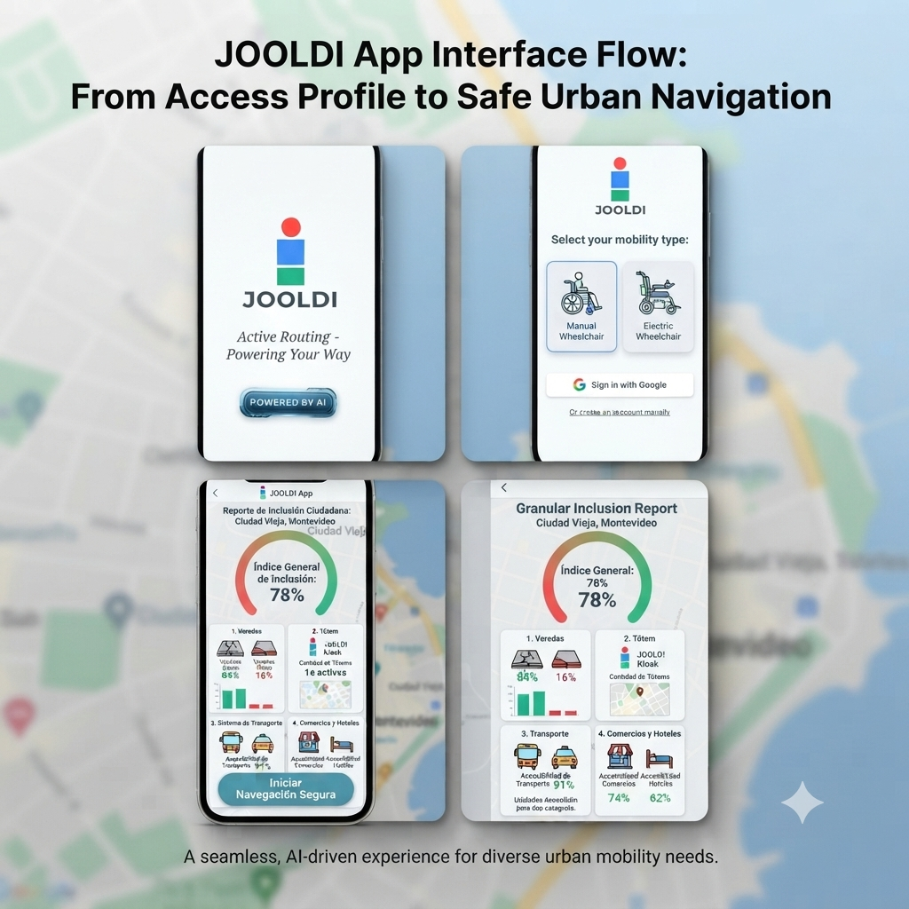

# JOOLDI App: Smart Urban Mobility
*Part of the JOOLDI Innovation Ecosystem*

### 🎯 Vision
The JOOLDI App serves as the digital companion to our physical infrastructure, providing real-time, AI-powered navigation for users with diverse mobility needs. It transforms urban accessibility by mapping infrastructure and social inclusion metrics.

### 🛠 Status & Role
* **Role in the Ecosystem:** Mapping, AI Integration, and User Profile management.
* **Status:** 🔵 In Integration.

### 🚀 Key Features
- **AI-Powered Human Interface:** The App acts as the first non-human point of contact. Upon arrival at a JOOLDI station, the AI offers real-time assistance: "Do you need human help for charging?". If confirmed, the system coordinates immediate human support.
- **Dynamic Secure Navigation:** AI-managed routing that prioritizes the fastest, most accessible paths based on real-time sidewalk conditions and mobility type (Manual vs. Electric Wheelchair).
- **Community-Driven Mapping:** A collaborative system where users report infrastructure issues (e.g., broken sidewalks). The AI dynamically updates the map to optimize routing for all community members.
- **Ecosystem Integration:** The app synchronizes directly with the JOOLDI physical charging network, bridging the gap between hardware status, human assistance, and safe urban mobility.

- ### 💳 Agentic Payment & Transaction Infrastructure
The system features a payment module integrated with **Mercado Pago (Production Credentials)** and automated by **Gemini**, enabling a frictionless monetization cycle for urban micromobility:

* **Dynamic Plans:** Automated management of charging time tariffs stored in scalable databases (`30 min / $50`, `1 hr / $90`, `2 hr / $160`).
* **Order Lifecycle:** Instant payment preference creation via API (`charging_orders`) ensuring full transaction traceability at the totem.
* **Webhooks & Async Confirmation:** Real-time payment validation that authorizes power delivery and autonomously updates node availability status.

### 🧠 Cognitive Engine & Orchestration via Gemini API
The platform's operational core implements direct calls to advanced models via the **Gemini API**, agentically processing urban environment variables to optimize totem services:

* **Real-Time Data Interpretation:** The `/app-api/charging/interpret` endpoint processes traffic flows, urban availability, and micromobility patterns using the **Gemini API** to make automated deployment decisions.
* **End-to-End Automation:** All business logic, from plan structuring to charging state management, operates natively via calls to the **Gemini API**, guaranteeing a fluid and decentralized response.
* **Synchronized Transactional Infrastructure:** The artificial intelligence not only analyzes the environment through the **Gemini API** but also securely communicates with production payment gateways to validate payment preferences and confirmation webhooks without human intervention.

### 📱 System Interface Overview
To ensure an intuitive user experience, the JOOLDI App operates through a streamlined, high-accessibility flow. The complete user journey—from AI activation and profile selection to live, secure navigation and granular inclusion reporting—is unified within a single application ecosystem.

*The JOOLDI App unified interface flow, demonstrating the progression from personalized mobility setup to real-time urban inclusion analytics and secure, accessible routing.*
---
> **JOOLDI Innovation Ecosystem** - *Building the future of smart urban infrastructure.*
